# Project: Scrum/DevOps Project Management System

A C# Scrum/DevOps project management domain akin to Azure/Jira, emphasizing object-oriented principles and at least six design patterns.

**Feedback for improvement**
1. Choose optimal patterns (e.g., decorator isn't always ideal).
2. Avoid hardcoded lines.
3. Factory pattern should strictly handle creation.
4. Class diagrams require methods.

## Requirements & Design
- **Functional:** Scrum project management, backlogs/sprints, deployment pipelines, discussion forums, and reporting.
- **Non-functional:** SonarCloud Quality Gate A, Git integration, and automated mock testing for notifications.
- **Patterns:** Factory (Creational); Strategy, State, Observer, Adapter, Decorator, and Visitor (Structural/Behavioral).

## Architecture & Diagrams:

### Package Diagram

### Domain Architecture & Flow

```mermaid
flowchart TD

subgraph group_planning["Scrum planning"]
  node_project["Project<br/>[Project.cs]"]
  node_sprint["Sprint lifecycle<br/>[Sprint.cs]"]
  node_sprint_states["Sprint states"]
  node_backlog["Backlog items<br/>[BackLogItem.cs]"]
  node_backlog_states["Backlog states"]
  node_team["Team and roles<br/>[TeamComposition.cs]"]
  node_strategies["Role behaviours"]
end

subgraph group_delivery["Pipeline actions"]
  node_pipeline["Pipeline model<br/>[Pipeline.cs]"]
  node_factory["Action factory<br/>[ActionFactory.cs]"]
  node_actions["Pipeline actions"]
  node_visitor["Action visitor<br/>[ActionVisitor.cs]"]
end

subgraph group_collaboration["Collaboration"]
  node_discussion["Discussion forum"]
  node_activity["Activity messages<br/>[Activity.cs]"]
end

subgraph group_reporting["Reports"]
  node_report_data["Sprint metrics<br/>[BurndownChart.cs]"]
  node_report["Report composition"]
end

subgraph group_integration["Notifications"]
  node_observer["Notification observers"]
  node_media_adapter["Media adapters<br/>[IMediaAdapter.cs]"]
end

node_user(("User"))
node_email(("Email service"))
node_slack(("Slack service"))
node_sms(("SMS service"))

node_user -->|"manages"| node_project
node_project -->|"organizes"| node_sprint
node_user -->|"updates"| node_backlog
node_backlog -->|"delegates state"| node_backlog_states
node_user -->|"advances"| node_sprint
node_sprint -->|"delegates state"| node_sprint_states
node_team -->|"uses behaviours"| node_strategies
node_user -->|"configures actions"| node_pipeline
node_pipeline -->|"creates actions"| node_factory
node_factory -->|"creates"| node_actions
node_actions -->|"accepts visits"| node_visitor
node_user -->|"collaborates"| node_discussion
node_user -->|"requests"| node_report
node_report -->|"formats metrics"| node_report_data
node_observer -.->|"uses adapters"| node_media_adapter
node_media_adapter -.->|"sends notification"| node_email
node_media_adapter -.->|"sends notification"| node_slack
node_media_adapter -.->|"sends notification"| node_sms

click node_project "https://github.com/mjunhaochen/devops/blob/main/DevOps/Domain/Project.cs"
click node_sprint "https://github.com/mjunhaochen/devops/blob/main/DevOps/Domain/Sprint.cs"
click node_sprint_states "https://github.com/mjunhaochen/devops/tree/main/DevOps/States/SprintState"
click node_backlog "https://github.com/mjunhaochen/devops/blob/main/DevOps/Domain/BackLogItem.cs"
click node_backlog_states "https://github.com/mjunhaochen/devops/tree/main/DevOps/States/BacklogState"
click node_team "https://github.com/mjunhaochen/devops/blob/main/DevOps/Domain/TeamComposition.cs"
click node_strategies "https://github.com/mjunhaochen/devops/tree/main/DevOps/Strategies"
click node_pipeline "https://github.com/mjunhaochen/devops/blob/main/DevOps/Domain/Pipeline.cs"
click node_factory "https://github.com/mjunhaochen/devops/blob/main/DevOps/Factories/ActionFactory.cs"
click node_actions "https://github.com/mjunhaochen/devops/tree/main/DevOps/Factories"
click node_visitor "https://github.com/mjunhaochen/devops/blob/main/DevOps/Visitors/ActionVisitor.cs"
click node_discussion "https://github.com/mjunhaochen/devops/blob/main/DevOps/Domain/DiscussionThread.cs"
click node_activity "https://github.com/mjunhaochen/devops/blob/main/DevOps/Domain/Activity.cs"
click node_report_data "https://github.com/mjunhaochen/devops/blob/main/DevOps/Domain/BurndownChart.cs"
click node_report "https://github.com/mjunhaochen/devops/tree/main/DevOps/Decorators"
click node_observer "https://github.com/mjunhaochen/devops/tree/main/DevOps/Observers"
click node_media_adapter "https://github.com/mjunhaochen/devops/blob/main/DevOps/Adapters/IMediaAdapter.cs"

classDef toneNeutral fill:#f8fafc,stroke:#334155,stroke-width:1.5px,color:#0f172a
classDef toneBlue fill:#dbeafe,stroke:#2563eb,stroke-width:1.5px,color:#172554
classDef toneAmber fill:#fef3c7,stroke:#d97706,stroke-width:1.5px,color:#78350f
classDef toneMint fill:#dcfce7,stroke:#16a34a,stroke-width:1.5px,color:#14532d
classDef toneRose fill:#ffe4e6,stroke:#e11d48,stroke-width:1.5px,color:#881337
classDef toneIndigo fill:#e0e7ff,stroke:#4f46e5,stroke-width:1.5px,color:#312e81
classDef toneTeal fill:#ccfbf1,stroke:#0f766e,stroke-width:1.5px,color:#134e4a
class node_project,node_sprint,node_sprint_states,node_backlog,node_backlog_states,node_team,node_strategies,node_user toneBlue
class node_pipeline,node_factory,node_actions,node_visitor toneAmber
class node_discussion,node_activity toneMint
class node_report_data,node_report toneRose
class node_observer,node_media_adapter,node_email,node_slack,node_sms toneIndigo
```

## Implementation & Deployment
Implemented in C# with unit tests focused on complex domain logic and rules. Includes a DevOps environment with source-control management and build/test pipelines.

*Note: Refer to comprehensive repository documentation for full details.*
